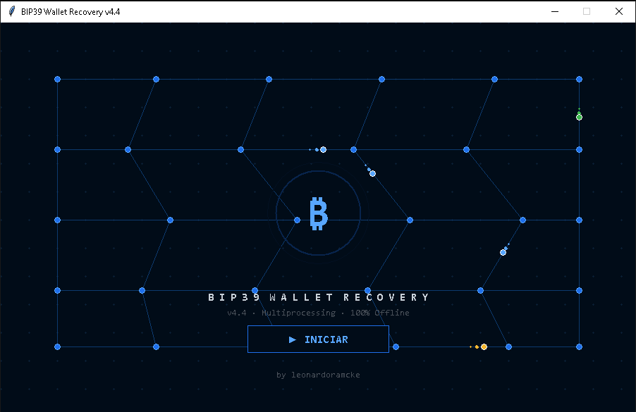
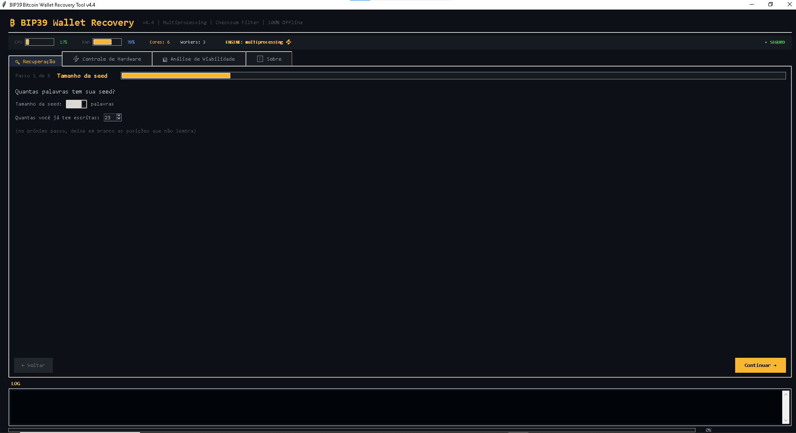
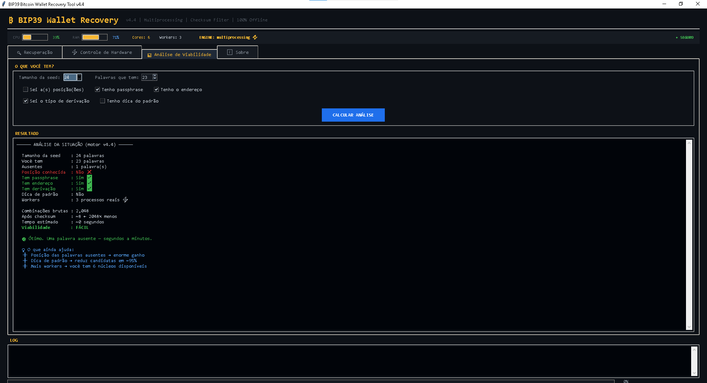
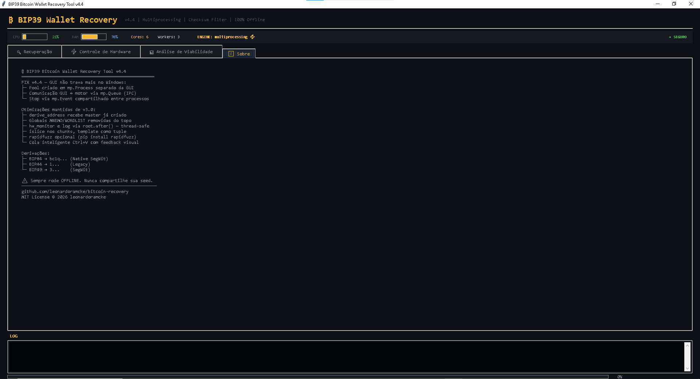
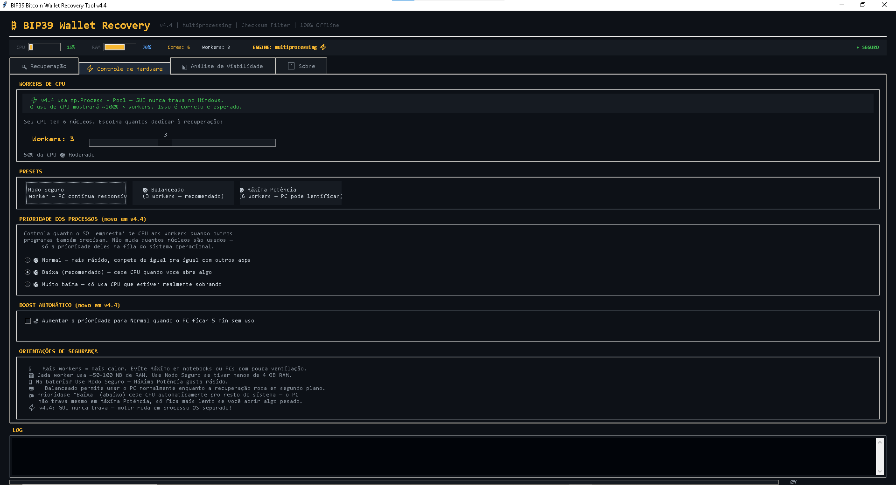

# ₿ BIP39 Bitcoin Wallet Recovery Tool

> Open-source GUI tool to recover Bitcoin wallets from incomplete BIP39 seed phrases. Runs 100% offline, built in Python, optimized for real hardware.


<p align="center">
  
</p>

---

## 📋 Table of Contents

- [About](#about)
- [Why this exists](#why-this-exists)
- [Screenshots](#screenshots)
- [How it works](#how-it-works)
- [Features](#features)
- [Performance](#performance)
- [Requirements](#requirements)
- [Installation](#installation)
- [Usage — step by step](#usage--step-by-step)
- [Feasibility reference table](#feasibility-reference-table)
- [Security](#security)
- [Architecture notes](#architecture-notes)
- [Dependencies](#dependencies)
- [License](#license)

---

## About

If you've lost part of your BIP39 seed phrase, there's no "forgot password" button in Bitcoin — the funds are locked to whoever can reconstruct the exact 12/15/18/21/24-word phrase. This tool performs an **intelligent, checksum-filtered brute-force search** for the missing word(s), deriving candidate addresses locally and comparing them against a Bitcoin address you already know.

Everything runs **100% locally on your machine**. No network calls, no telemetry, no external services — the seed phrase never leaves your computer.

> ⚠️ This tool is meant to recover **your own** wallets. Never use it against an address or seed that isn't yours.

---

## Why this exists

Losing one word out of 24 sounds small — it isn't. Each unknown word multiplies the search space by 2048 (the size of the BIP39 wordlist). Doing this by hand, or with a naive script, is either impossibly slow or dangerously exposes the seed to some online "recovery service." This tool exists to do the search **safely, offline, and as fast as the hardware genuinely allows** — without needing to trust anyone else with your seed.

---

## Screenshots

| Guided setup wizard | Hardware control |
|---|---|
|  |  |

| Feasibility analysis | Recovery in progress |
|---|---|
|  |  |

---

## How it works

The recovery flow is a pipeline of cheap-to-expensive filters, so the costly steps only ever run on candidates that already survived the cheap ones:

```
 1. Generate candidate word(s) for the missing position(s)
          │
 2. BIP39 checksum filter  (O(1) dict lookup + bit math — microseconds per candidate)
          │  → rejects the vast majority of candidates instantly
 3. PBKDF2-HMAC-SHA512  (2048 iterations — the "expensive" BIP39 step, by design)
          │  → derives the 512-bit seed from the candidate mnemonic
 4. BIP32 key derivation  (via coincurve / libsecp256k1, in C)
          │  → derives the account key once, then each address index
 5. Address encoding  (Bech32 / Base58Check depending on BIP84/44/49)
          │
 6. Compare against your known address → match found?
```

Steps 3–4 are the real cost (PBKDF2 is *intentionally* slow — that's what makes BIP39 resistant to brute force in general). Everything before that is optimized to be as close to free as possible, so CPU time is spent almost entirely on candidates that have a real chance of being correct.

---

## Features

- 🧙 **Guided 6-step wizard** — seed size → words → hints → position → credentials → summary, instead of one overwhelming form
- ✅ **Real-time word validation** — each word field turns green/red as you type, checked against the official BIP39 wordlist
- 🔎 **Smart hints** — filter candidates by starting letter, exact length, or Levenshtein-distance typo matching
- ⚡ **Multiprocessing engine** — a real OS process pool (not threads), so the GUI never freezes, even on Windows
- 🎚️ **User-controlled CPU usage** — pick how many cores to dedicate, plus OS-level process priority (Normal / Low / Idle) so the search never has to fight your other programs for CPU
- 🌙 **Optional idle boost** — automatically raises priority only when the PC has been idle for 5+ minutes (Windows), and lowers it back the moment you're active again
- 📊 **Feasibility analysis tab** — get a realistic time estimate *before* committing to a search, calibrated against your actual hardware speed (not a hardcoded guess)
- 🧭 **Auto-detects address type** — paste a `bc1q.../1.../3...` address and it pre-selects BIP84/44/49 for you
- 🔐 Support for **BIP84** (`bc1q...`), **BIP44** (`1...`) and **BIP49** (`3...`) derivation paths
- 🔑 Support for an optional **passphrase** (the BIP39 "25th word")
- 🖥️ Dark, terminal-style GUI with a live exportable log

---

## Performance

This isn't a v1 — it went through several rounds of real profiling and fixes:

| Optimization | Before | After |
|---|---|---|
| Key derivation (`bip32utils` → `coincurve`, C bindings for libsecp256k1) | ~3.6 ms/derivation | ~0.32 ms/derivation (**~11x faster**) |
| BIP39 checksum check (`mnemonic.check()` O(n) list search → dict O(1)) | as low as ~2,700 checks/s in the worst case | 400,000+ checks/s, consistently |
| Chunk size sent between worker processes (previously unbounded) | could balloon to 70M+ tuples per chunk (RAM spikes) | capped to 500–4,000 per chunk |
| Time estimate | fixed, guessed constant | **self-calibrated** against real hardware on first run |

All derivation code is validated against the [official BIP32 test vectors](https://github.com/bitcoin/bips/blob/master/bip-0032.mediawiki#test-vectors) — see `fast_bip32.py`, which includes a self-test you can run directly (`python fast_bip32.py`).

---

## Requirements

- **Python 3.8 or higher**
  Download at: https://python.org/downloads
  ⚠️ During installation, check **"Add Python to PATH"**

---

## Installation

### 1. Clone the repository

```bash
git clone https://github.com/leonardoramcke/bitcoin-recovery.git
cd bitcoin-recovery
```

Or download the ZIP from GitHub and extract it to a folder.

### 2. Install dependencies

**Windows:**
```bash
py -m pip install -r requirements.txt
```

**Mac/Linux:**
```bash
pip3 install -r requirements.txt
```

Wait for `Successfully installed...` to appear in the terminal.

> `coincurve` ships with prebuilt wheels for Windows/Mac/Linux in almost all cases — no C compiler needed. If pip ever asks for "Microsoft Visual C++ Build Tools," it just means it fell back to building from source; installing those build tools (or upgrading pip) resolves it.

---

## Usage — step by step

### Opening the program

**Windows:**
```bash
cd "C:\path\to\bitcoin-recovery"
py bitcoin_recovery.py
```

**Mac/Linux:**
```bash
cd ~/path/to/bitcoin-recovery
python3 bitcoin_recovery.py
```

An animated intro screen opens first — click **▶ INICIAR** to launch the main app.

### Inside the app — the wizard

1. **Seed size** — how many words your seed has (12/15/18/21/24), and how many you already know.
2. **Words** — paste all known words at once (auto-distributed into the grid) or type them field by field. Leave blank whatever you don't remember. Fields turn green (valid BIP39 word) or red (not recognized) as you type.
3. **Hints** *(optional, but each one drastically cuts search time)* — starting letter, exact word length, or a possible typo to search similar BIP39 words against.
4. **Position** — if you know *which* position(s) are missing, tell it (much faster than searching all positions).
5. **Credentials** — your known Bitcoin address (type auto-detected), optional passphrase, and derivation settings.
6. **Summary** — review the estimated time and combination count (calibrated to your CPU), then click **▶ Iniciar recuperação**.

### Hardware Control tab

Choose how many CPU cores to use (with Safe / Balanced / Max Power presets), and the OS-level priority for the worker processes — so the search never makes your computer unusable for anything else.

### Feasibility Analysis tab

Run this *before* starting a real search if you just want to know "is this even realistic?" — enter what you know (seed size, words you have, whether you know the position, passphrase, address, derivation type) and get a time estimate and difficulty rating.

---

## Feasibility reference table

| Missing words | Rough search space (post-checksum) | Estimated time* |
|---|---|---|
| 1 (last position) | a handful of candidates | Seconds |
| 1 (unknown position) | ~2,000 candidates | Seconds to minutes |
| 2 | ~16,000 candidates | Minutes |
| 3 | ~33 million candidates | Hours to days |
| 4 | ~68 billion candidates | Weeks to months |
| 5+ | astronomically large | Not realistically feasible on CPU |

*\*Actual time depends on your CPU and how many workers/priority you configure — the app measures this live and shows a calibrated estimate before you start.*

> Every extra word or hint you can supply (starting letter, exact length, known position) cuts the search space dramatically — often by orders of magnitude.

---

## Security

> ⚠️ **IMPORTANT — read before using**

- Always run **offline** — disconnect from the internet before using this for a real recovery
- **Never** enter your seed phrase into any website or online "recovery service"
- **Never** share your seed words with anyone
- This program makes **zero** network calls — verify it yourself, the source is right here
- All processing happens locally, in memory, on your machine
- After finding your seed: **write all words on paper immediately**, and consider moving funds to a new wallet with a freshly generated seed

---

## Architecture notes

- The GUI (`tkinter`) and the recovery engine run in **separate OS processes** (`multiprocessing.Process` + `Pool`), communicating via a `Queue` — this is what keeps the interface responsive even at 100% CPU usage on all cores, and avoids the classic Windows "Not Responding" freeze that happens when a `Pool` is created inside a GUI thread.
- Candidate generation is fully lazy (`itertools.product` + chunked `islice`) — the full combination space is never materialized in memory, only fixed-size chunks (500–4,000 candidates) are.
- Key derivation (`fast_bip32.py`) is a from-scratch BIP32 implementation on top of `coincurve` (C bindings for libsecp256k1), validated against the official test vectors — no dependency on slower pure-Python elliptic curve math.

---

## Dependencies

```
mnemonic>=0.21
coincurve>=20.0
bech32>=1.2
psutil>=5.9
base58>=2.1
rapidfuzz>=3.0
```

---

## License

MIT License — © 2026 leonardoramcke

You are free to use, copy, modify and distribute this software **with attribution to the original author**.
See the [LICENSE](LICENSE) file for full details.
